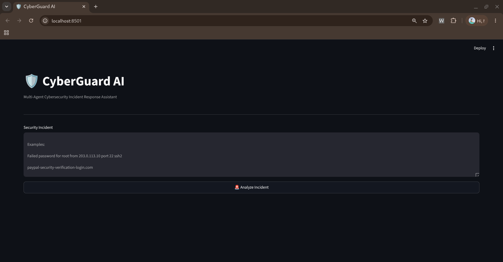
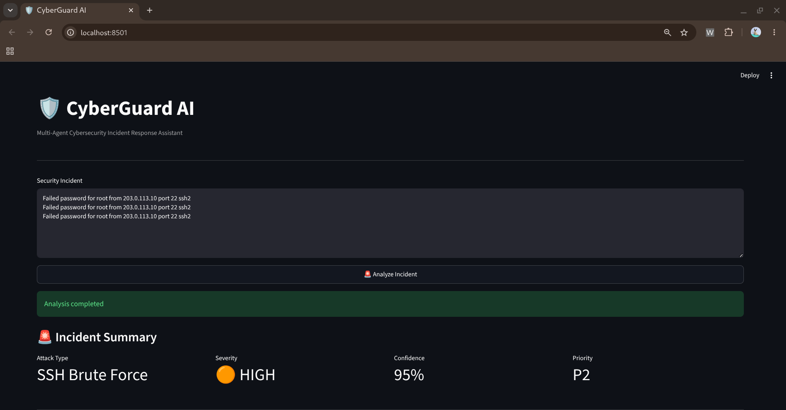
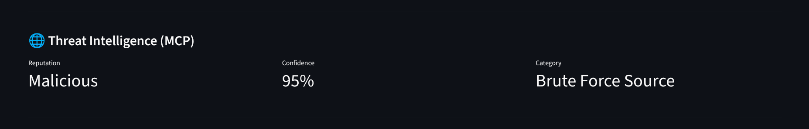
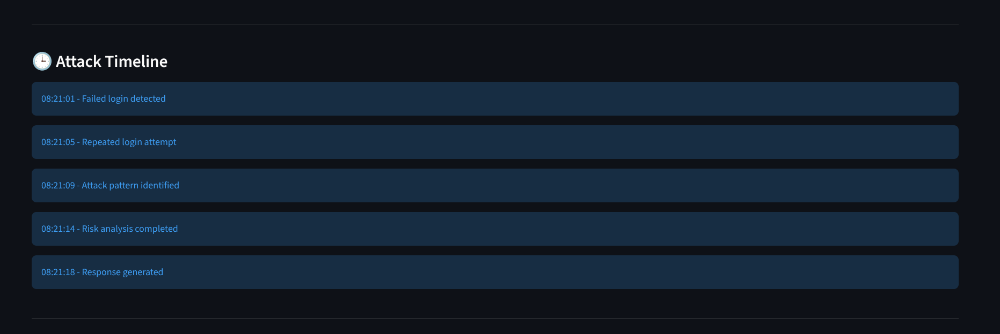
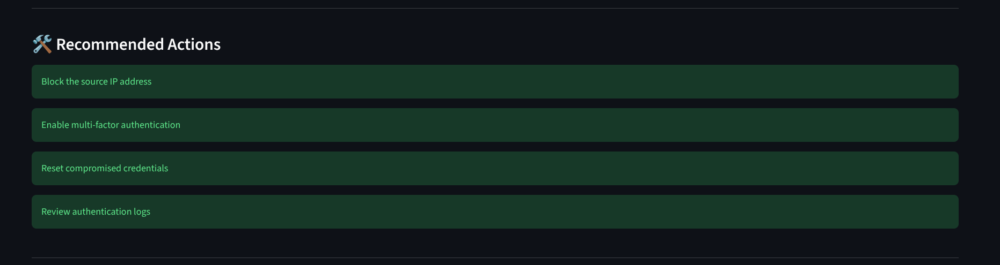
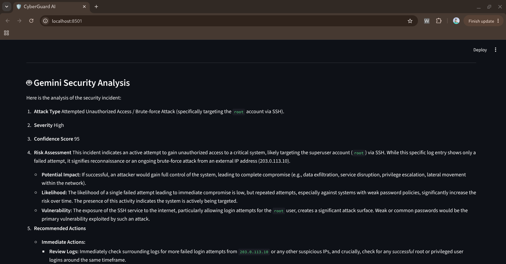
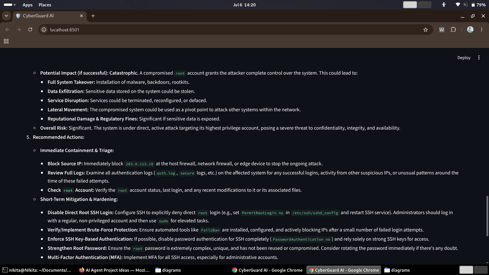
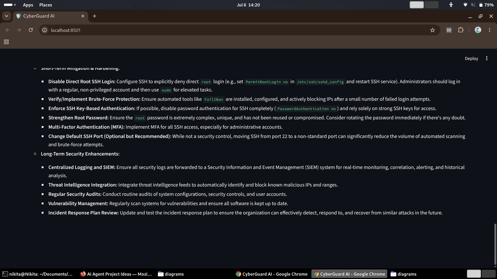

# 🛡️ CyberGuard AI

# Multi-Agent Cybersecurity Incident Response Platform

> Built with Google ADK • Powered by Google Gemini • Integrated with MCP Threat Intelligence

CyberGuard AI is an AI-powered multi-agent cybersecurity incident response platform designed to automate threat detection, threat intelligence enrichment, risk assessment, and incident response recommendations.

The platform leverages Google's Agent Development Kit (ADK) for multi-agent orchestration, Google Gemini for advanced security reasoning, and MCP servers for threat intelligence enrichment.

---

## 🚀 Features

✅ Multi-Agent Security Orchestration  
✅ Google ADK Integration  
✅ Google Gemini Security Analysis  
✅ MCP Threat Intelligence Enrichment  
✅ Attack Detection Engine  
✅ Threat Classification  
✅ Risk Scoring  
✅ Automated Incident Response  
✅ Security Reporting  
✅ Interactive Streamlit Dashboard

---

# 🏗️ System Architecture


---

# 🤖 Google ADK Integration

CyberGuard AI uses Google's Agent Development Kit (ADK) as the orchestration layer for coordinating multiple cybersecurity agents.

The ADK orchestration layer manages:

- 📄 Log Analysis Agent
- 🚨 Threat Classification Agent
- 📊 Risk Scoring Agent
- 🛡️ Response Agent
- 📑 Report Agent

This architecture enables structured multi-agent execution while leveraging Google Gemini for advanced security reasoning and MCP for threat intelligence enrichment.

---

# ⚙️ Multi-Agent Workflow

The CyberGuard AI platform follows a coordinated multi-agent workflow:

### 1️⃣ Google ADK Orchestrator
- Manages agent execution flow
- Coordinates communication between agents
- Controls workflow execution

### 2️⃣ Log Agent
- Detects attack patterns
- Performs attack classification
- Calculates confidence score

### 3️⃣ Threat Agent
- Assigns severity
- Classifies cyber threats
- Maps threat intelligence

### 4️⃣ Risk Agent
- Calculates risk score
- Determines incident priority
- Performs risk assessment

### 5️⃣ Response Agent
- Generates mitigation actions
- Suggests security controls
- Produces incident response plan

### 6️⃣ Report Agent
- Generates incident reports
- Aggregates findings
- Produces final analysis

### 7️⃣ Google Gemini Agent
- Performs advanced LLM reasoning
- Generates contextual security analysis
- Produces recommendations

### 8️⃣ MCP Threat Intelligence
- Enriches incidents
- Provides reputation data
- Supplies threat intelligence context

---

# 🛠️ Technology Stack

| Component | Technology |
|-----------|------------|
| Multi-Agent Framework | Google ADK |
| LLM | Google Gemini |
| Threat Intelligence | MCP Server |
| Frontend | Streamlit |
| Backend | Python |
| Version Control | Git/GitHub |

---

# 📷 Dashboard Screenshots

## Main Dashboard



---

## Incident Summary



---

## MCP Threat Intelligence



---

## Attack Timeline



---

## Recommended Actions



---

## Gemini Security Analysis

### Part 1



### Part 2



### Part 3



---

# 🧪 Example Incident

Input:

```text
Failed password for root from 203.0.113.10 port 22 ssh2
```

Output:

```json
{
  "attack_type": "SSH Brute Force",
  "confidence": 95,
  "severity": "HIGH",
  "priority": "P2"
}
```

---

# ▶️ Running CyberGuard AI

Clone repository:

```bash
git clone https://github.com/Nikita4305/CyberGuard_AI.git
cd CyberGuard_AI
```

Install dependencies:

```bash
pip install -r requirements.txt
```

Run dashboard:

```bash
streamlit run app.py
```

---

# 📂 Project Structure

```text
CyberGuard_AI/
│
├── agents/
├── adk/
├── mcp/
├── diagrams/
├── examples/
├── app.py
├── requirements.txt
└── README.md
```

---

# 🏆 Key Concepts Demonstrated

✅ Google ADK  
✅ Multi-Agent Systems  
✅ Google Gemini  
✅ MCP Servers  
✅ Cybersecurity Automation  
✅ Threat Intelligence  
✅ Incident Response  
✅ AI Security Operations

---

# 📌 Future Improvements

- Real-time SIEM integration
- Live threat intelligence feeds
- Automated SOC playbooks
- RAG-based security knowledge base
- Multi-LLM support
- Autonomous incident response workflows

---

# 👩‍💻 Author

**Nikita**

Built for the **Kaggle AI Agents: Intensive Vibe Coding Capstone Project**

---
