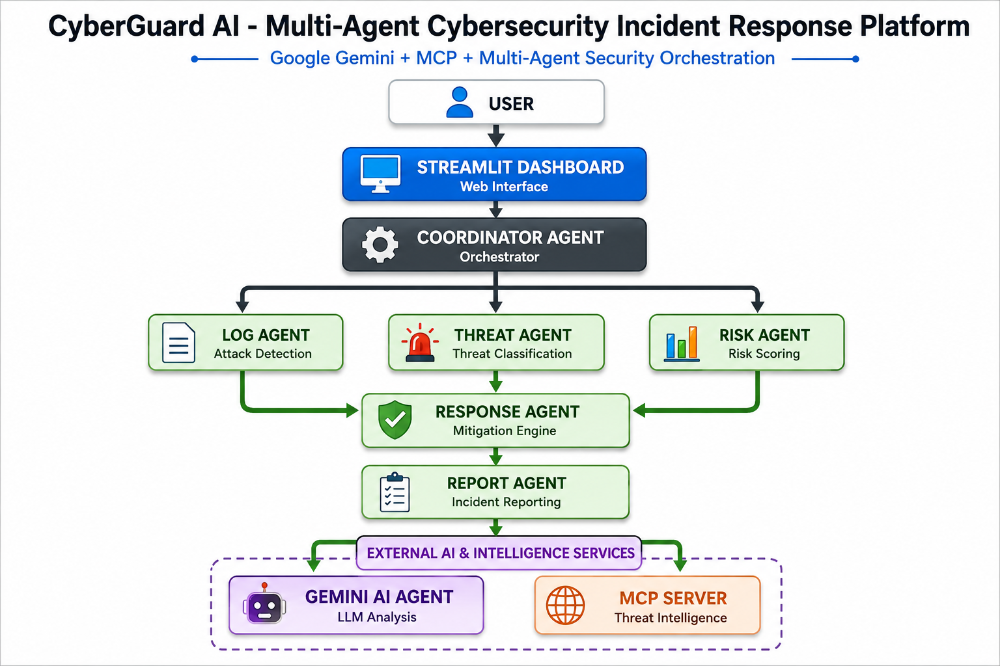

# 🛡️ CyberGuard AI

# Multi-Agent Cybersecurity Incident Response Platform

> Google Gemini + MCP + Multi-Agent Security Orchestration

CyberGuard AI is an intelligent multi-agent cybersecurity incident response platform that automates the analysis, classification, risk assessment, mitigation, and reporting of cybersecurity incidents.

The project leverages multiple specialized agents, Google Gemini for advanced security reasoning, MCP (Model Context Protocol) for threat intelligence enrichment, and an interactive Streamlit dashboard for incident investigation.

---

# 🚀 Problem Statement

Security Operations Centers (SOCs) face thousands of security alerts daily. Manual analysis of incidents is time-consuming, error-prone, and requires highly skilled analysts.

CyberGuard AI addresses this challenge by providing an AI-powered multi-agent incident response system that:

- Detects attacks
- Classifies threats
- Calculates risk
- Suggests mitigation actions
- Generates incident reports
- Enriches incidents with AI and threat intelligence

---

# ✨ Features

✅ Multi-Agent Cybersecurity Workflow

✅ Google Gemini Security Analysis

✅ MCP Threat Intelligence Integration

✅ Attack Detection

✅ Threat Classification

✅ Risk Scoring

✅ Automated Mitigation Suggestions

✅ Incident Reporting

✅ Interactive Streamlit Dashboard

✅ Extensible Security Architecture

---

# 🏗️ System Architecture



---

# ⚙️ Multi-Agent Workflow

The CyberGuard AI platform follows a coordinated multi-agent workflow:

### 1. Coordinator Agent
- Orchestrates the complete incident response process.
- Routes information between agents.

### 2. Log Agent
- Detects attack patterns from security logs.
- Identifies possible attack vectors.

### 3. Threat Agent
- Classifies the detected threat.
- Determines threat severity.

### 4. Risk Agent
- Calculates organizational risk score.
- Assigns response priority.

### 5. Response Agent
- Generates mitigation and containment actions.
- Provides actionable security recommendations.

### 6. Report Agent
- Creates structured incident reports.
- Summarizes investigation findings.

### 7. Gemini AI Agent
- Performs advanced security reasoning.
- Provides contextual analysis.

### 8. MCP Threat Intelligence Server
- Enriches incidents with threat intelligence.
- Provides reputation and threat context.

---

# 🖥️ Dashboard

CyberGuard AI provides an interactive Streamlit dashboard that allows analysts to:

- Submit security incidents
- Analyze attack patterns
- View threat severity
- Calculate risk scores
- Generate mitigation actions
- Obtain Gemini AI analysis
- Review threat intelligence

---

# 📂 Project Structure

```text
CyberGuard_AI/
│
├── agents/
│   ├── coordinator.py
│   ├── log_agent.py
│   ├── threat_agent.py
│   ├── risk_agent.py
│   ├── response_agent.py
│   ├── report_agent.py
│   └── gemini_agent.py
│
├── mcp/
│   └── threat_server.py
│
├── examples/
│   ├── brute_force.txt
│   ├── phishing.txt
│   ├── malware.txt
│   ├── ddos.txt
│   ├── port_scan.txt
│   └── ransomware.txt
│
├── diagrams/
│   └── architecture.png
│
├── app.py
├── requirements.txt
└── README.md
```

---

# 🔧 Technologies Used

| Technology | Purpose |
|------------|---------|
| Python | Core Development |
| Streamlit | Web Dashboard |
| Google Gemini | AI Security Analysis |
| MCP | Threat Intelligence |
| Git | Version Control |
| GitHub | Repository Management |

---

# 🛠️ Installation

Clone the repository:

```bash
git clone https://github.com/Nikita4305/CyberGuard_AI.git
cd CyberGuard_AI
```

Create virtual environment:

```bash
python3 -m venv venv
source venv/bin/activate
```

Install dependencies:

```bash
pip install -r requirements.txt
```

Run the application:

```bash
streamlit run app.py
```

---

# 🧪 Example Security Incidents

## SSH Brute Force

```text
Failed password for root from 203.0.113.10 port 22 ssh2
Failed password for root from 203.0.113.10 port 22 ssh2
Failed password for root from 203.0.113.10 port 22 ssh2
```

---

## Phishing Domain

```text
paypal-security-verification-login.com
```

---

## Malware Hash

```text
44d88612fea8a8f36de82e1278abb02f
```

---

## Sample Output

```text
Attack Type:
SSH Brute Force

Severity:
HIGH

Risk Score:
85

Priority:
P2

Recommended Actions:
- Block source IP
- Enable MFA
- Reset credentials
- Review authentication logs
```

---

# 🤖 AI Components

The project integrates:

### Google Gemini
- Advanced security reasoning
- Incident analysis
- Contextual recommendations

### MCP Server
- Threat intelligence enrichment
- Reputation scoring
- Threat categorization

---

# 🔮 Future Enhancements

- SIEM Integration
- Real-time Threat Feeds
- Cloud Security Monitoring
- MITRE ATT&CK Mapping
- Automated Incident Containment
- Threat Hunting Module
- SOC Dashboard Analytics
- Security Alert Prioritization

---

# 🏆 Kaggle Capstone Technologies Used

✅ Google Gemini

✅ Multi-Agent Architecture

✅ MCP Integration

✅ AI Security Analysis

✅ Interactive Dashboard

---

# 👩‍💻 Author

**Nikita**

B.Tech Engineering Student  
Cybersecurity Enthusiast  
Google x Kaggle Vibe Coding Capstone Participant

---

# 📜 License

This project is developed for educational and research purposes under the Google x Kaggle Vibe Coding Capstone Program.
